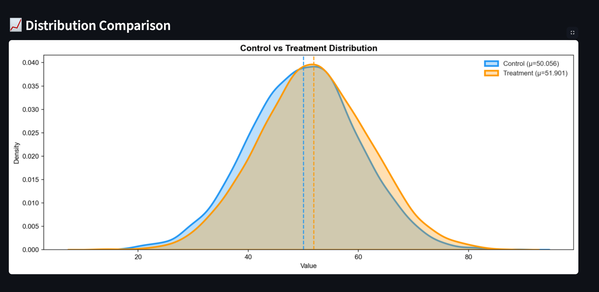
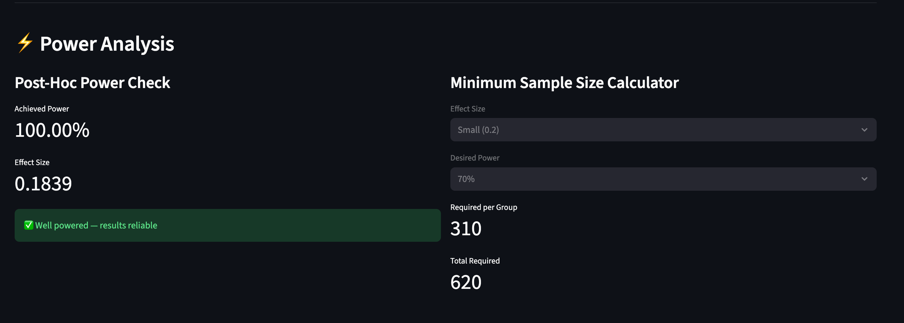
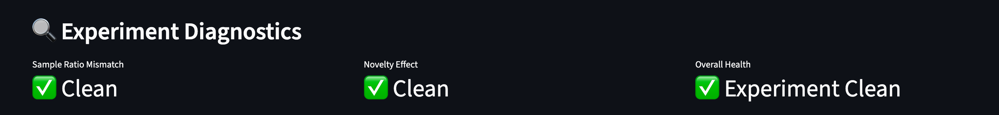

# 🧪 A/B Testing Framework

> Production-grade statistical testing suite for experiments — built by Vansh Ajmera, Economics @ IIT Kanpur

---

## 🎯 What It Does

A reusable Python framework that automates the full statistical analysis of A/B experiments — the kind used by Amazon, Google, and Flipkart to test product changes at scale.

Given experiment data, it:
- Runs the correct statistical test (t-test, z-test, or chi-square)
- Calculates effect size (Cohen's d) and 95% confidence intervals
- Checks if the experiment was well-powered
- Applies multiple testing corrections (Bonferroni, Benjamini-Hochberg)
- Runs diagnostic checks (SRM, novelty effect, peeking risk)
- Outputs a complete experiment report

---

## 🖥️ Demo

### Experiment Summary


### Distribution Comparison


### Power Analysis


### Diagnostics

---

## 🏗️ Project Structure
---

## 🔬 Statistical Tests

### 1. T-Test (Continuous Metrics)
```python
tester = ABTester(control, treatment)
tester.t_test()
# Use for: revenue per user, time on site, order value
```

### 2. Proportion Z-Test (Binary Metrics)
```python
tester.proportion_z_test()
# Use for: conversion rate, click rate, signup rate
```

### 3. Chi-Square (Categorical / Multi-variant)
```python
tester.chi_square_test(
    control_success, control_total,
    treatment_success, treatment_total
)
# Use for: A/B/C/D tests, categorical outcomes
```

---

## 📊 Sample Output — E-commerce Checkout Test

**Scenario:** Simplified checkout (treatment) vs original (control)

| Metric | Value |
|---|---|
| Control Conversion | 4.14% |
| Treatment Conversion | 5.68% |
| Relative Lift | +37% |
| Z-statistic | 3.56 |
| P-value | 0.0004 |
| Significant | ✅ Yes (α=0.05) |
| Cohen's d | 0.07 (Negligible) |
| 95% CI | [0.69%, 2.39%] |
| Power | 100% (n=5000) |
| SRM | ✅ Clean |
| Verdict | ✅ Ship it |

---

## ⚡ Power Analysis

```python
from power_analysis import minimum_sample_size

# How many users do I need?
minimum_sample_size(effect_size=0.2, power=0.80)
# → 394 per group (788 total)
```

| Effect Size | Power=70% | Power=80% | Power=90% |
|---|---|---|---|
| Small (0.2) | 310/group | 394/group | 527/group |
| Medium (0.5) | 51/group | 64/group | 86/group |
| Large (0.8) | 21/group | 26/group | 34/group |

---

## 🔧 Multiple Testing Corrections

```python
from power_analysis import bonferroni_correction, benjamini_hochberg

p_values = [0.03, 0.04, 0.001]
bonferroni_correction(p_values)   # strict
benjamini_hochberg(p_values)      # moderate
```

---

## 🔍 Experiment Diagnostics

```python
from diagnostics import full_diagnostic_report

full_diagnostic_report(
    n_control=5000,
    n_treatment=5000,
    treatment_data=treatment
)
```

Checks for:
- **Sample Ratio Mismatch** — was traffic split correctly?
- **Novelty Effect** — are users just excited about something new?
- **Peeking Risk** — did we check results too early?

---

## ✅ Unit Tests

```bash
pytest test_ab_tester.py -v
```
---

## 🚀 How to Run

### 1. Clone the repo
```bash
git clone https://github.com/VanshA17/projects.git
cd projects/ab_testing_framework
```

### 2. Install dependencies
```bash
pip install pandas numpy scipy statsmodels matplotlib seaborn streamlit pytest
```

### 3. Run the Streamlit app
```bash
streamlit run app.py
```

### 4. Or run the demo notebook
```bash
jupyter notebook demo.ipynb
```

### 5. Run unit tests
```bash
pytest test_ab_tester.py -v
```

---

## 🛠️ Tech Stack

| Tool | Purpose |
|---|---|
| `scipy.stats` | T-test, chi-square |
| `statsmodels` | Z-test, power analysis |
| `pandas` / `numpy` | Data handling |
| `matplotlib` / `seaborn` | Visualizations |
| `streamlit` | Interactive web app |
| `pytest` | Unit testing |

---

## 💡 Key Statistics Concepts Used
- Hypothesis Testing (t-test, z-test, chi-square)
- Statistical Significance & P-values
- Effect Size (Cohen's d)
- Confidence Intervals
- Statistical Power & Sample Size
- Multiple Testing (Bonferroni, Benjamini-Hochberg)
- Experiment Diagnostics (SRM, Novelty Effect, Peeking)

---

## 👤 Author
**Vansh Ajmera**  
Economics, IIT Kanpur  
[GitHub](https://github.com/VanshA17) | [LinkedIn](https://www.linkedin.com/in/vansh-ajmera-347a56339/)